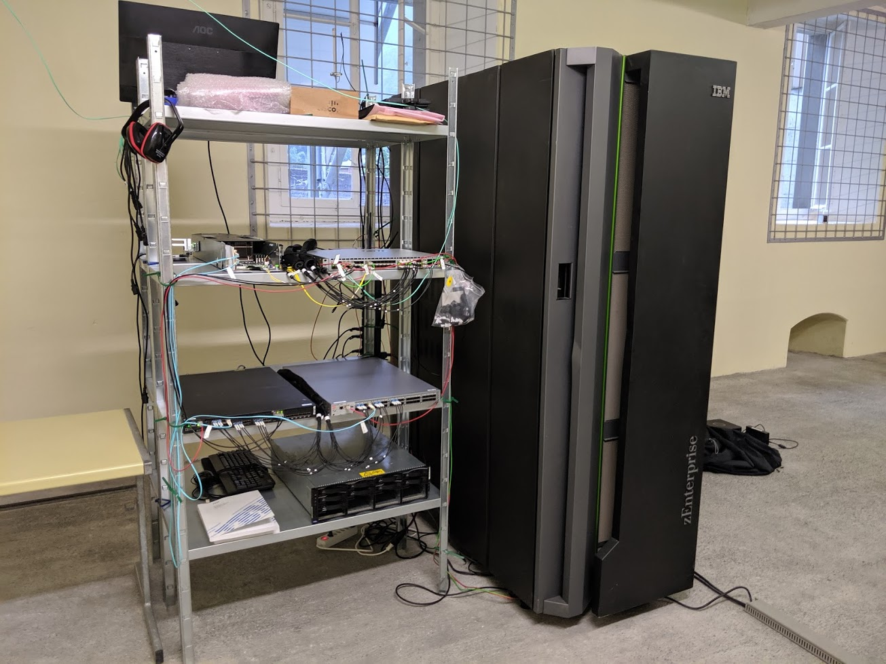
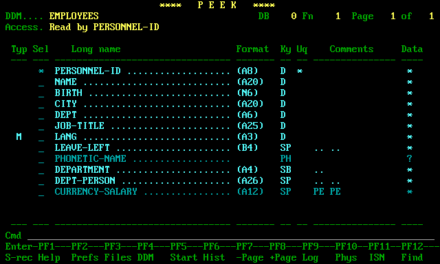

 # Артем и его работа на второй линии поддержки СУБД ADABAS

Артем — опытный специалист, работающий на **второй линии поддержки** 
СУБД **ADABAS**. Его основные обязанности включают:

- **Диагностика и устранение сложных проблем**, с которыми не справляется первая линия поддержки.
- **Анализ логов и метрик** для выявления причин сбоев и оптимизации производительности.
- **Взаимодействие с разработчиками** для внесения изменений в код и улучшения стабильности системы.
- **Обучение и консультирование** коллег из первой линии поддержки, помогая им расти профессионально.

Артем ценит свою работу за возможность постоянно учиться и решать нестандартные задачи. 
Его вклад в поддержку СУБД ADABAS неоценим, 
и он всегда готов прийти на помощь в самых сложных ситуациях.
### Mainframe z114

### СУБД ADABAS

